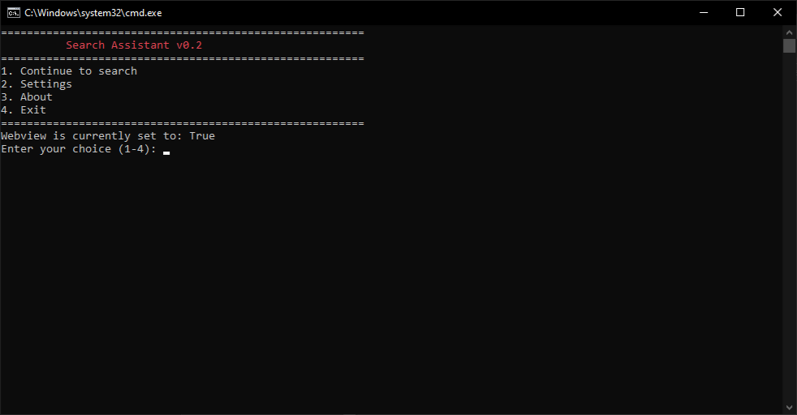
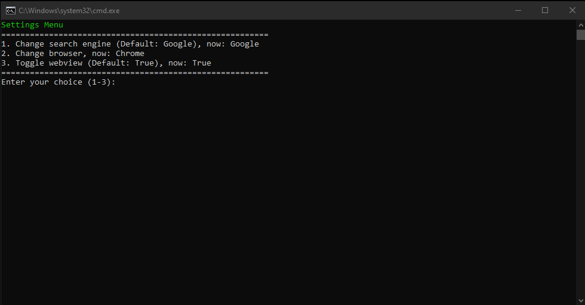
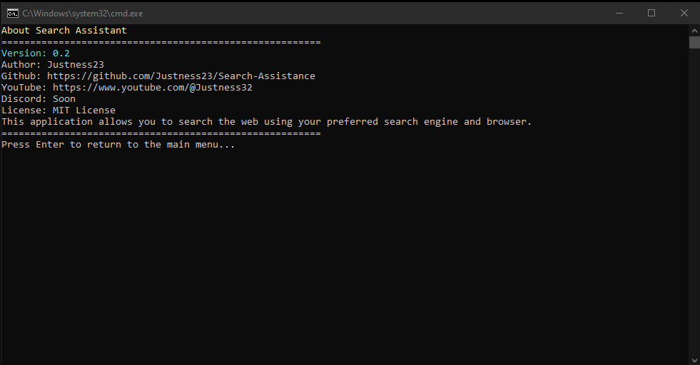
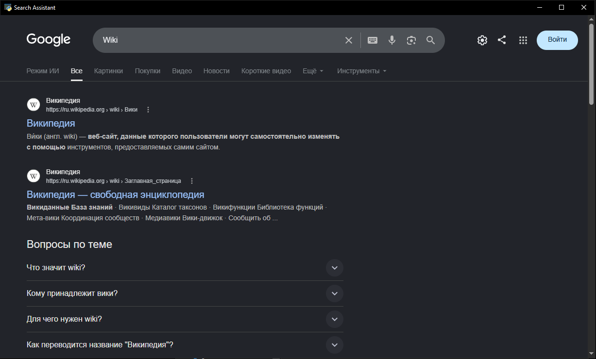

<p align="center">
  
</p>
<p align="center">
  <h1 align="center">Search Assistace</h1>
</p>

<p align="center">
  Find what you want and where you want
</p>

<br>

<p align="center">
  
  
  
  
</p>

<br>

### A lightweight CLI/WebView tool for quick searches without unnecessary system load and opening cumbersome browsers.

<br>

## Features:
### ⚡ WebView instead of heavy browsers: Saves RAM
### 🔍 Multi-search: quickly switch between Google, Brave and others.
### 🛠 One-click installation: built-in script for automatic dependency installation

<br>

<details>
<summary><h2>Screenshots<h2/></summary>
  <blockquote>
    <h2 align="center">Main Menu</h1>
    <p align="center">
      
    <p/>
    <br>
    <h2 align="center">Settings Menu</h1>
    <p align="center">
      
    <p/>
    <br>
    <h2 align="center">About Menu</h1>
    <p align="center">
      
    <p/>
    <br>
    <h2 align="center">WebView</h1>
    <p align="center">
      
    <p/>
  </blockquote>
</details>

<br>
 
## Quick Start:
### 🖥 Requirements
- Windows 7/10/11
- Python(3.11+)
- tomli-w
- colorama
- PyWebView

### 📥 Download
1. Download latest version [HERE](https://github.com/Justness23/Search-assistance/releases)
2. Download python (3.11+) [HERE](https://www.python.org/downloads/)
3. Download tomli-w, colorama, pywebview(or start 'install_packages.bat')
```bash
pip install tomli-w colorama pywebview
```
4. Start SearchAssistance.bat

<br>

## Roadmap
1. 🚫 AD Blocker
2. 📟 GUI
3. 🧠 Smart-Assistant

<br>
<br>

<p align="center">
  <a href="https://discord.gg/38GFPNXkx">
    
  </a>
  <a href="https://github.com/justness23">
    
  </a>
  <a href="https://www.donationalerts.com/r/justness233">
    
  </a>
</p>

